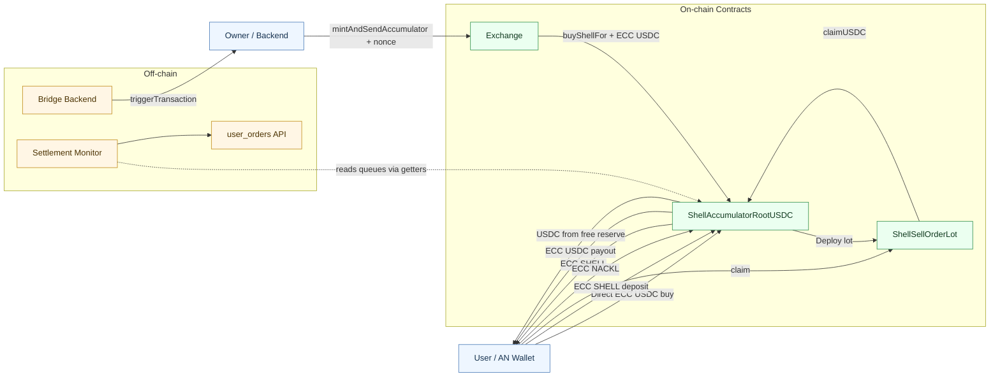

# Architecture

## Contract roles

**ShellAccumulatorRootUSDC** is the central contract. It holds all ECC balances (USDC and SHELL from sellers), manages four FIFO queues (one per denomination), matches buyers against sellers, mints SHELL when sellers are insufficient, pays out USDC on claims, and handles NACKL redemption.

**ShellSellOrderLot** is a lightweight per-order contract deployed by the Root when a seller deposits SHELL. It stores the seller's address, denomination, and order ID. Its only active function is `claim()`, which calls back into Root's `claimUSDC`. After payout confirmation, it self-destructs.

**AccumulatorLib** is a pure library used by the Root to compute deterministic lot addresses. It salts the lot code with `(versionLib, root)` and encodes `(_denom, _orderId)` as static variables, producing a unique address per lot.

**Exchange** is a separate contract that bridges TIP-3 USDC into ECC USDC. It has two paths: the `onTransferReceived` callback (triggered when someone sends TIP-3 USDC to the Exchange's wallet) and admin-only `mintAndSend` / `mintAndSendAccumulator` functions. It connects to the Accumulator at a hardcoded `ACCUMULATOR_ADDRESS`.

## FIFO queue model

Each denomination (1, 10, 100, 1000) has four counters:

| Counter      | Meaning                                      |
| ------------ | -------------------------------------------- |
| `nextId`     | Next order ID to assign (starts at 1)        |
| `available`  | Number of lots waiting to be matched         |
| `soldPrefix` | Contiguous prefix of sold lots               |
| `owedCount`  | Sold lots whose USDC hasn't been claimed yet |

Order IDs are **1-based** (`nextId` starts at 1). The first lot gets `orderId = 1`, the second gets `orderId = 2`, etc. `soldPrefix = 3` means lots 1, 2, 3 are sold.

Key invariant: `available <= nextId - 1 - soldPrefix`. Total created = `nextId - 1`. Of those, `soldPrefix` are sold, `available` are waiting to be matched, and the rest are in transition.

## Address coupling

Exchange sends buy flow to a **fixed** `ACCUMULATOR_ADDRESS` (`0x3535...3535`)
