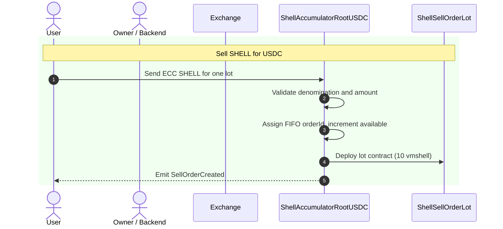
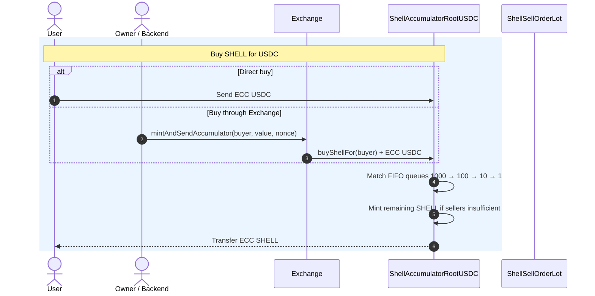
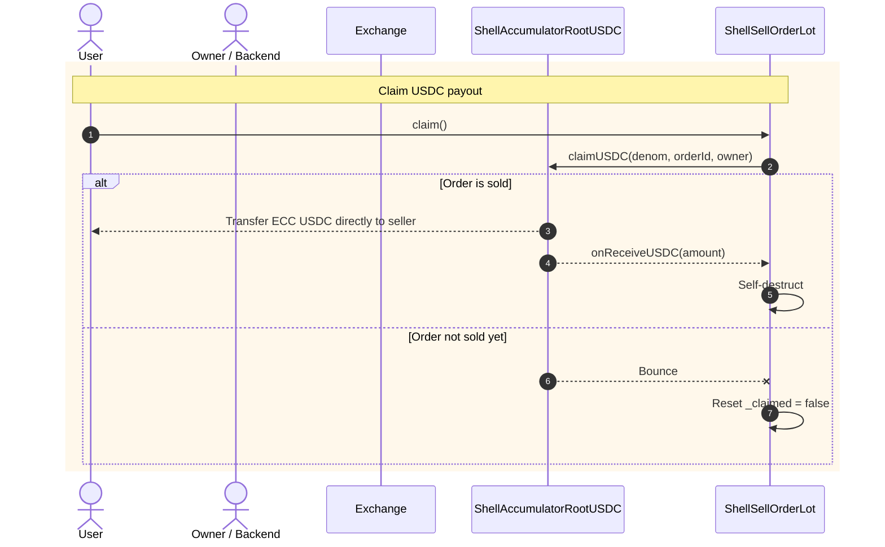
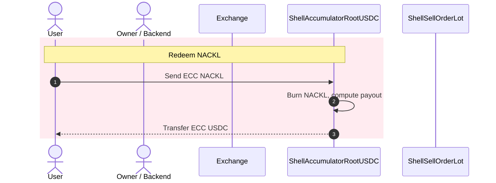

# Flows

All four primary flows in the Accumulator system.

## Sell — deposit SHELL



A seller creates a lot by sending ECC SHELL to the Root's `receive()`. The amount must correspond to exactly one denomination:

| Denomination | SHELL required (nanoSHELL)  |
| ------------ | --------------------------- |
| 1 USDC       | 100,000,000,000 (100 × 10⁹) |
| 10 USDC      | 1,000,000,000,000           |
| 100 USDC     | 10,000,000,000,000          |
| 1000 USDC    | 100,000,000,000,000         |

**What happens on-chain:**

1. Root validates `shellAmount % SHELL_PER_USDC == 0` and the resulting denomination is one of {1, 10, 100, 1000}.
2. Assigns `orderId = nextId[D]`, increments `nextId[D]` and `available[D]`.
3. Adds `shellAmount` to `_sellerShellPool`.
4. Deploys a new `ShellSellOrderLot` contract with deterministic address derived from `(code, root, denom, orderId)`.
5. Emits `SellOrderCreated` twice: once to the seller's external address (for per-user subscription) and once to external address `610` (for global monitoring).

**Result:** the seller holds a lot contract and waits for a buyer to match it.

***

## Buy — deposit USDC



A buyer sends ECC USDC to the Root (directly or via Exchange). The amount must be in whole USDC units (`amount % 1_000_000 == 0`).

**Matching algorithm (largest-first FIFO):**

```
remaining = usdcAmount / USDC_DECIMALS_FACTOR   // whole USDC

for each D in [1000, 100, 10, 1]:
    take = min(available[D], remaining / D)
    if take > 0:
        available[D]  -= take
        soldPrefix[D] += take
        owedCount[D]  += take
        remaining     -= take * D
        totalShellFromSellers += take * D * SHELL_PER_USDC

if remaining > 0:
    mint remaining * SHELL_PER_USDC fresh ECC SHELL

send totalShellFromSellers + mintedShell to buyer
```

**Important details:**

* Matching is greedy: it takes as many lots as possible from the largest denomination first.
* If sellers partially cover the amount, the rest is minted. The buyer always gets 100% of the SHELL.
* The USDC stays on the Root. It is tracked in `_usdcBalance` and becomes available for seller claims and NACKL redemption.
* Two events are emitted: `ShellPurchased` (to ext addr 611) and `MatchedOrders` (to ext addr 617, with current `soldPrefix` values).

**Note on `buyShellFor` vs `receive`:** Both accept ECC USDC and trigger the same `_processUsdcDeposit` logic. The difference: `receive()` rejects messages carrying more than one ECC currency (`require(currencies.keys().length <= 1)`), while `buyShellFor()` only checks that USDC is present. If a multi-currency message arrives via `buyShellFor`, the non-USDC ECC will remain on the contract.

***

## Claim — seller collects USDC



After a lot is matched (sold), the seller calls `claim()` on their lot contract to receive the USDC payout.



### SellOrderLot.claim()

Sets `_claimed = true`, then calls `Root.claimUSDC(denom, orderId, owner)`.



### Root.claimUSDC()

Verifies the caller's address matches the expected lot address (recomputed deterministically), checks `orderId <= soldPrefix[D]` (lot is sold), checks `owedCount[D] > 0`, and checks `_usdcBalance >= owedTotal`. If all pass:

* Sends `D × USDC_DECIMALS_FACTOR` ECC USDC **directly to the seller** (not to the lot).
* Calls `SellOrderLot.onReceiveUSDC(payout)` to confirm.
* Decrements `owedCount[D]` and `_usdcBalance`.



### SellOrderLot.onReceiveUSDC()

Verifies the amount, emits `OrderDestroyed`, self-destructs back to the Root.



### If the lot is not yet sold

`claimUSDC` reverts (require fails), the message bounces back, and the lot's `onBounce` handler resets `_claimed = false`. The seller can try again later.



### Double-claim protection

Double-claim protection is multi-layered: the lot checks `!_claimed` before calling, the Root checks `owedCount > 0`, and the lot self-destructs after success — so the contract ceases to exist.



***

## Redeem NACKL



A NACKL holder sends ECC NACKL to the Root's `receive()` to burn it and claim a share of the "free reserve" — USDC not owed to any seller.

**Payout formula:**

```
supply        = M(t)                    // NACKL emission curve
currentSupply = supply - _nacklBurned   // subtract all previously burned NACKL
redeemable    = _usdcBalance - owedUsdcTotal()  // free reserve

payout = redeemable × burnAmount / currentSupply
```

Where `M(t) = T_KM × (1 - exp(-u_M × t))`, capped at `NACKL_T`. `t` is seconds since `_unixstart`.

**Key point:** `currentSupply` is **not** `M(t)` — it's `M(t) minus all NACKL burned to date`. As more NACKL is burned, the denominator shrinks, so each subsequent burn receives a larger share of the remaining reserve. This is by design: later redeemers get proportionally more of whatever USDC is left.



### Burn the NACKL

Burn the NACKL via `gosh.burnecc()`.



### Compute currentSupply and check it

Compute `currentSupply` and check it's sufficient.



### Compute redeemable and check it

Compute `redeemable` (free reserve) and check it's positive.



### Compute payout

Compute `payout = redeemable * burnAmount / currentSupply`.



### Update balances

Increment `_nacklBurned`, decrement `_usdcBalance`.



### Send payout

Send ECC USDC to the sender.



***

## Exchange TIP3 to ECC USDC through Exchange

The Exchange also has `onTransferReceived` — a callback from its TIP-3 USDC wallet. When someone sends TIP-3 USDC to the Exchange's wallet, it mints equivalent ECC USDC and sends it back to the depositor's address (not to the Accumulator). The depositor can then send it to the Accumulator directly.
