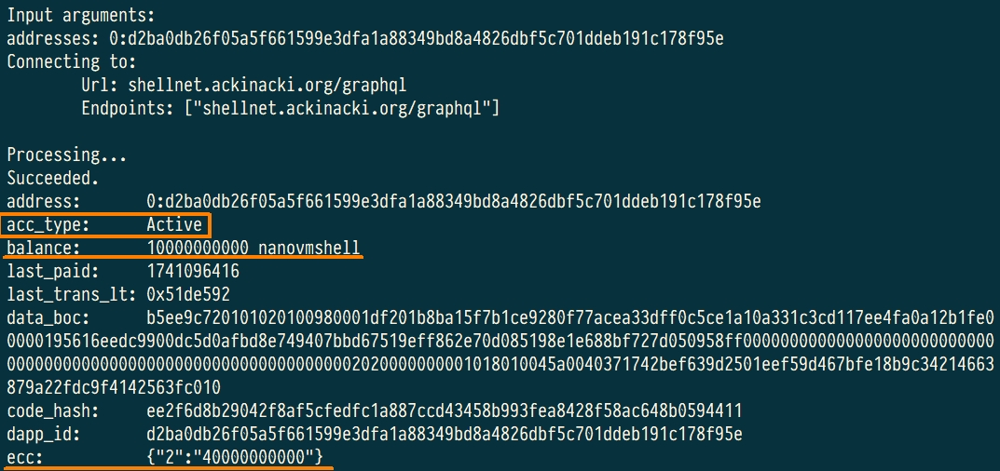
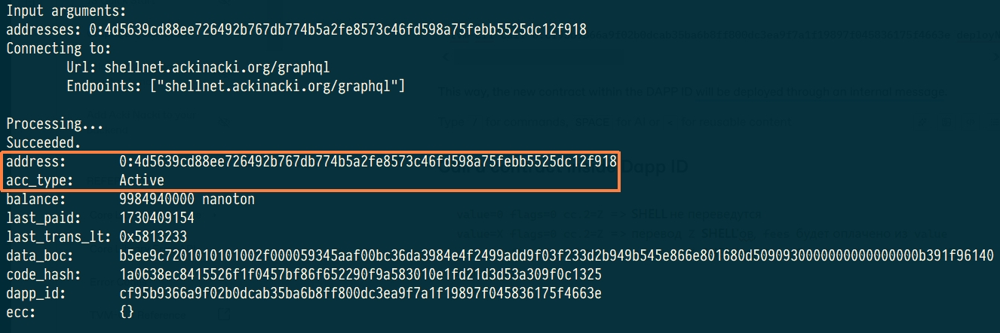
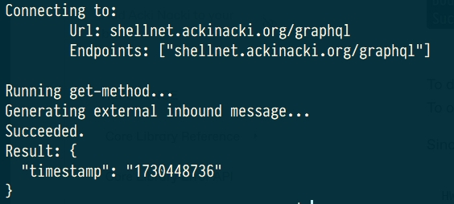
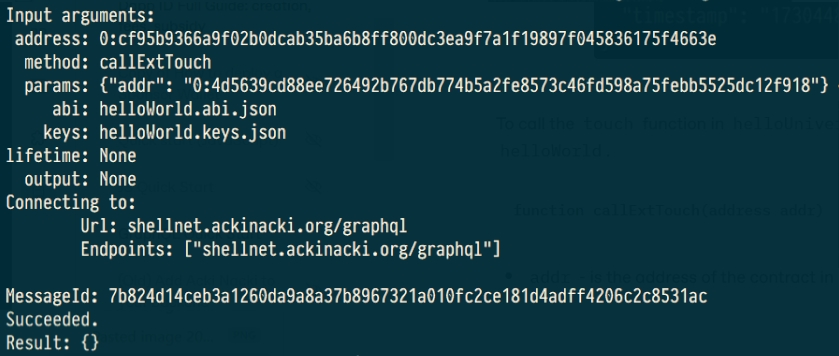

# Dapp ID Full Guide: creation, fees, centralized replenishment

## **What will you learn from this guide?** <a href="#prerequisites" id="prerequisites"></a>

* How to create your [Dapp ID](https://docs.ackinacki.com/glossary#dapp-id)
* How to interact with contracts inside a Dapp&#x20;
* How to interact with contracts of other Dapps
* How to use the centralized replenishment mechanism for the Dapp ID contracts

## **Prerequisites** <a href="#prerequisites" id="prerequisites"></a>

* [TVM-Solidity-Compiler](https://github.com/gosh-sh/TVM-Solidity-Compiler)
* [TVM-CLI and Multisig Wallet](how-to-deploy-a-multisig-wallet.md)

## Configure CLI tool

In this guide, we will use the test network at [`shellnet.ackinacki.org`](https://shellnet.ackinacki.org).\
We need to specify the blockchain endpoint for deployment:

```
tvm-cli config -g --url shellnet.ackinacki.org/graphql
```

## Create your first Dapp ID

You create a new Dapp ID when you deploy a contract using an external message. The address of this contract becomes the DAPP ID of your system..

If your DAPP consists of multiple contracts, you need to implement your system so that all the contracts are deployed either from the root contract or its children.

In this guide, we will use the [`helloWorld`](https://github.com/tvmlabs/sdk-examples/blob/main/contracts/helloWorld/helloWorld.sol) contract to demonstrate the features of a DAPP ID.

```solidity
pragma tvm-solidity >=0.76.0;
pragma AbiHeader expire;

interface IHelloWorld {
    function touch() external;
}


// This is class that describes you smart contract.
contract helloWorld {
    // Contract can have an instance variables.
    // In this example instance variable `timestamp` is used to store the time of `constructor` or `touch`
    // function call
    uint32 public timestamp;

    // The contract can have a `constructor` – a function that is called when the contract is deployed to the blockchain.
    // Parameter `value` represents the number of SHELL tokens to be converted to VMSHELL to pay the transaction fee.
    // In this example, the constructor stores the current timestamp in an instance variable.
    // All contracts need to call `tvm.accept()` for a successful deployment.
    constructor(uint64 value) {
        // Call the VM command to convert SHELL tokens to VMSHELL tokens to pay the transaction fee.
        gosh.cnvrtshellq(value);

        // Ensure that the contract's public key is set.
        require(tvm.pubkey() != 0, 101);

        // // Verify that the message is signed (msg.pubkey() is not zero) 
        // // and that it is signed with the owner's private key.
        // require(msg.pubkey() == tvm.pubkey(), 102);

        // The current smart contract agrees to buy some gas to complete the
        // current transaction. This action is required to process external
        // messages, which carry no value (and therefore no gas).
        tvm.accept();

        // Set the instance variable to the current block timestamp.
        timestamp = block.timestamp;
    }

    // Converts SHELL to VMSHELL for payment of transaction fees
    function exchangeToken(uint64 value) public pure {
        tvm.accept();
        gosh.cnvrtshellq(value);
    }

    // Returns a static message, "helloWorld".
    // This function serves as a basic example of returning a fixed string in Solidity.
    function renderHelloWorld () public pure returns (string) {
        return 'helloWorld';
    }

    // Updates the `timestamp` variable with the current blockchain time.
    // We will use this function to modify the data in the contract.
    // Сalled by an external message.
    function touch() external {
        // Informs the TVM that we accept this message.
        tvm.accept();
        // Update the timestamp variable with the current block timestamp.
        timestamp = block.timestamp;
    }

    // Used to call the touch method of a contract via an internal message.
    // Parameter 'addr' - the address of the contract where the 'touch' will be invoked.
    function callExtTouch(address addr) public view {
        // Each function that accepts an external message must check that
        // the message is correctly signed.
        require(msg.pubkey() == tvm.pubkey(), 102);
        tvm.accept();
        IHelloWorld(addr).touch();
    }

    // Sends VMSHELL to another contract with the same Dapp ID.
    function sendVMShell(address dest, uint128 amount, bool bounce) public view {
        require(msg.pubkey() == tvm.pubkey(), 102);
        tvm.accept();
        // Enables a transfer with arbitrary settings
        dest.transfer(varuint16(amount), bounce, 0);
    }

    /// Allows the custodian if they are the sole owner of multisig wallet, to transfer funds with minimal fees.
    /// Parameter `dest` - the target address to receive the transfer.
    /// Parameter `value`- the amount of SHELL tokens to transfer.
    function sendShell(address dest, uint128 value) public view {
        require(msg.pubkey() == tvm.pubkey(), 102);
        tvm.accept();

        TvmCell payload;
        mapping(uint32 => varuint32) cc;
        cc[2] = varuint16(value);
        // Executes transfer to target address
        dest.transfer(0, true, 1, payload, cc);
    }

    /// Deploys a new contract within its Dapp.
    /// The address of the new contract is calculated as a hash of its initial state.
    /// The owner's public key is part of the initial state.
    /// Parameter `stateInit` - the contract code plus data.
    /// Parameter `initialBalance` - the amount of funds to transfer. 
    /// Parameter `payload` - a tree of cells used as the body of the outbound internal message.
    function deployNewContract(
        TvmCell stateInit,
        uint128 initialBalance,
        TvmCell payload
    )
        public pure
    {
        // Runtime function to deploy contract with prepared msg body for constructor call.
        tvm.accept();
        address addr = address.makeAddrStd(0, tvm.hash(stateInit));
        addr.transfer({stateInit: stateInit, body: payload, value: varuint16(initialBalance)});
    } 

}


```

### **Prepare contract source code**

Let's create a folder for our project and clone the [repository](https://github.com/tvmlabs/sdk-examples/tree/main) with examples into it:

<pre><code>cd ~
mkdir helloWorld
<strong>cd helloWorld
</strong>git clone https://github.com/tvmlabs/sdk-examples.git

</code></pre>

and copy the `contracts` folder from there:

```
cp -r sdk-examples/contracts .
cd contracts/helloWorld
```

### **Compile**

Compile the contract `helloWorld` using TVM Solidity compiler:

```
sold --tvm-version gosh helloWorld.sol
```

The compiler produces `helloWorld.tvc` and `helloWorld.abi.json` to be used in the next steps.

TVM binary code of your contract is stored into `helloWorld.tvc` file.

### **Top up with Shell**

To deploy a contract, its balance must be funded with SHELL tokens.

To do this, we first need to determine its address. Let's start by generating a **seed phrase** and **keys** for your contract:

<pre><code><strong>tvm-cli genphrase --dump helloWorld.keys.json
</strong></code></pre>


**Seed phrase** is printed to stdout.\
**Key pair** will be generated and saved to the file **`helloWorld.keys.json`**.


<figure><figcaption></figcaption></figure>


**Write your Seed Phrase down and store it somewhere safe, and never share it with anyone. Avoid storing it in plain text or screenshots, or any other non-secure way. If you lose it, you will not be able to recover it from your Key Pair. If you lose both Seed Phrase and Key Pair you lose access to your assets. Anyone who gets it, gets full access to your assets.**\
**Also, save the file with a pair of keys in a safe place.**


Now let's generate the **contract address** using the keys obtained earlier:

```
tvm-cli genaddr helloWorld.tvc --save --setkey helloWorld.keys.json
```


After this step, the `.tvc` file will be overwritten with the specified keys.


Address of your contract in the blockchain is located after `Raw address:`

<figure><figcaption></figcaption></figure>


**Save `Raw address` value** - you will need it to deploy your contract and to work with it.\
We will refer to it as **`<YourAddress>`** below.


To top up the balance (approx. 10 SHELL) of the `helloWorld` contract, [use your Multisig Wallet](how-to-deploy-a-multisig-wallet.md#how-to-use-a-sponsor-wallet)&#x20;

and apply the following method `sendTransaction`:

```
sendTransaction( address dest, uint128 value, mapping(uint32 => varuint32) cc, bool bounce, uint8 flags, TvmCell payload)
```

* `dest`  - the transfer target address;
* `value`  - the amount of funds (VMSHELL) to transfer (should be `0`);
* `cc`  - the type of ECC token and amount  to transfer;
* `bounce`  - [bounce flag](https://github.com/gosh-sh/TON-Solidity-Compiler/blob/master/API.md#addresstransfer): (should be `false`);
* `flags-`[sendmsg flags](https://github.com/gosh-sh/TON-Solidity-Compiler/blob/master/API.md#addresstransfer) (should be `1`);
* `payload` - [tree of cells used as body](https://github.com/gosh-sh/TON-Solidity-Compiler/blob/master/API.md#addresstransfer) of the outbound internal message (should be an empty string).&#x20;

For example: you can use the command:

```
tvm-cli call 0:90c1fe4ab3a86a112e72a587fa14b89ecb2836da0b4ec465543dc0bb62df1430 sendTransaction '{"dest":"0:cf95b9366a9f02b0dcab35ba6b8ff800dc3ea9f7a1f19897f045836175f4663e", "value":0, "bounce":false, "cc": {"2": 1000000000}, "flags": 1, "payload": ""}' --abi multisig.abi.json --sign multisig.keys.json
```


Within DappID, you can transfer both ECC tokens (e.x.SHELL) and VMSHELL. \
**For contracts of other DAPP IDs, only ECC tokens can be transferred.**


Check the state of the pre-deployed contract. It should be `Uninit`:

```
tvm-cli account <YourAddress>
```

You will see something similar to the following:

<figure><figcaption></figcaption></figure>

### Deploy

When you deploy a contract with external message contract must  exchange some amount of [SHELL](https://docs.ackinacki.com/glossary#shell) into [VMSHELL](https://docs.ackinacki.com/glossary#vmshell) during the contract deployment. To do this, the contract’s constructor must call the VM command `gosh.cnvrtshellq(uint64 value).`&#x20;


**CNVRTSHELLQ converts SHELL to VMSHELL  at a 1:1 ratio**

Q in the end stands for ‘quiet’ which means that if there is not enough Shell, it will not throw an exception.

If the account balance does not have the required number of tokens, the exchange will be made for the entire available amount. That is, MIN(available\_tokens, want\_to\_convert\_amount).


Go back now and check the constructor code of `helloWallet` - you will find this command.

Lets deploy `helloWorld` and create our first Dapp ID with this command:

```
tvm-cli deploy --abi helloWorld.abi.json --sign helloWorld.keys.json helloWorld.tvc '{"value":10000000000}'
```

<figure><figcaption></figcaption></figure>

6. Check the contract state again. This time, it is should be `Active`.

<figure><figcaption></figcaption></figure>

**View contract information with Explorer**

Go to [testnet Acki Nacki explorer](https://shellnet.ackinacki.org) and search for in search bar.\
Open your account page. You will need it later to see its transactions and messages, that we will produce in the next steps.

<figure><figcaption></figcaption></figure>

**Explore contract information with GraphQL**

Go to [GraphQL playground](https://shellnet.ackinacki.org/graphql).

Enter the information in the left pane and click the "Run" button (replace the contract's address with the one you obtained in the previous steps).

```
query {
  accounts(
    filter: {
      id: {
        eq: "<YourAddress>"
      }
    }
  ) {
    acc_type_name
    dapp_id
    balance
    code
    code_hash
    data
  }
}
```


The `dapp_id` field will contain the identifier of your decentralized contract system on the Acki Nacki blockchain.


You will see something that looks similar following:

<figure><figcaption></figcaption></figure>


**You can specify any other fields in the result section that are available in GraphQL Schema.**\
Click the icon   in the upper-left corner of the screen to view the API documentation.


## **Run a getter**&#x20;

The `helloWorld` contract features a get-method: `timestamp`. Let's call it and check the result:

```
tvm-cli run <YourAddress> timestamp {} --abi helloWorld.abi.json
```

result:

<figure><figcaption></figcaption></figure>

## Call a method on-chain

The `helloWorld` contract has a `touch` method, lets run it on-chain with `call` command:

The `helloWorld` contract has a `touch` method. Let’s run it on-chain using the `call` command:

```
tvm-cli call <YourAddress> touch {} --abi helloWorld.abi.json --sign helloWorld.keys.json
```

<figure><figcaption></figcaption></figure>

Call the get-method `timestamp` again to verify that the timestamp has been updated:

<figure><figcaption></figcaption></figure>

## Add another contract to your Dapp ID


To add a contract to the DAPP ID system, it must be deployed via an internal message through the root contract of the DAPP ID, which in our case is `helloworld`.


In our case, this can be done using the following function:

```
function deployNewContract(
        TvmCell stateInit,
        uint128 initialBalance,
        TvmCell payload
    )
```

* `stateInit`  - the contract code plus data (tvc in base64);
* `initialBalance`  - the amount of funds to transfer;
* `payload`  - a tree of cells used as the body of the outbound internal message;

Let’s add another contract to our DAPP ID. For this, we’ll use a copy of the `helloWorld` contract and name it `helloUniverse:`

```
cp helloWorld.tvc helloUniverse.tvc
cp helloWorld.abi.json helloUniverse.abi.json
```

Now, let’s calculate the address of the `helloUniverse` contract using the existing key pair.

```
tvm-cli genaddr helloUniverse.tvc --save --setkey helloWorld.keys.json
```

And we get the same address as the `helloWorld` contract.

<figure><figcaption></figcaption></figure>

To avoid this, it’s essential to use a different key pair. \
Let’s generate a new seed phrase with a fresh pair of keys:

```
tvm-cli genphrase --dump helloUniverse.keys.json
```

<figure><figcaption></figcaption></figure>

Let’s calculate the address and prepare the TVC file for the new contract:

```
tvm-cli genaddr helloUniverse.tvc --save --setkey helloUniverse.keys.json
```

<figure><figcaption></figcaption></figure>

To deploy a new contract, you need to prepare its `stateInit` and a deployment message body.

To obtain the `stateInit`, execute the following command:

Since the result can be quite large, let’s save this value in a variable: `HW_STATE_INIT`.&#x20;

```
HW_STATE_INIT=$(base64 -w 0 helloUniverse.tvc)
```

Let’s generate the message body with a constructor call for the internal deployment of the contract from another contract.:

```
tvm-cli body --abi helloUniverse.abi.json constructor '{"value": 10000000000}'
```

<figure><figcaption></figcaption></figure>

We’ll need to place the `Message body` field value into the deployment payload.

Now we can call  `deployNewContract` function.

In our case, the command will be as follows:

```
tvm-cli call 0:cf95b9366a9f02b0dcab35ba6b8ff800dc3ea9f7a1f19897f045836175f4663e deployNewContract '{"stateInit":"'$HW_STATE_INIT'", "initialBalance":10000000000, "payload":"te6ccgEBAQEADgAAGHA94s8AAAACVAvkAA=="}' --abi helloWorld.abi.json 
```

This way, the new contract within the DAPP ID will be deployed through an internal message.

Check the contract state:&#x20;

<figure><figcaption></figcaption></figure>


Note that the `helloUniverse` contract shares **the same DAPP ID** as the `helloWorld` contract.


## Call a contract inside Dapp ID

To transfer  SHELL, within the same DAPP ID, use the function `sendShell`

```
function sendShell(address dest, uint128 value)
```

* `dest` - the target address to receive the transfer;
* &#x20;`value`  - the amount of SHELL tokens to transfer.

To transfer  VMSHELL, within the same DAPP ID, use the function `sendVMShell`

```
function sendVMShell(address dest, uint128 amount, bool bounce)
```

* `dest` - the target address to receive the transfer;
* `amount`  - the amount of VMSHELL tokens to transfer.
* `bounce`  - [bounce flag](https://github.com/gosh-sh/TON-Solidity-Compiler/blob/master/API.md#addresstransfer): (should be `false`);


Let's call the `touch` function in `helloUniverse` through the `helloWorld` contract.\
But first, let's check the value of the `timestamp` variable in the `helloUniverse` contract.

```
tvm-cli run <Address_helloUniverse> timestamp {} --abi helloUniverse.abi.json
```

result:

<figure><figcaption></figcaption></figure>

To call the `touch` function in `helloUniverse`, we’ll invoke the `callExtTouch` method in `helloWorld`.

```
function callExtTouch(address addr)
```

* `addr` - is the address of the contract in which the method is called.

In our case, the command will be as follows:

```
tvm-cli call 0:cf95b9366a9f02b0dcab35ba6b8ff800dc3ea9f7a1f19897f045836175f4663e callExtTouch '{"addr": "0:4d5639cd88ee726492b767db774b5a2fe8573c46fd598a75febb5525dc12f918"}' --abi helloWorld.abi.json --sign helloWorld.keys.json
```

<figure><figcaption></figcaption></figure>

Then, let's check if the `timestamp` has changed in the `helloUniverse` contract:

<figure><figcaption></figcaption></figure>

Output: The timestamp has changed.


The fee distribution for message transfers within a single DAPP ID is described in the "[Fees](dapp-id-full-guide-creation-fees-centralized-replenishment.md#fees)" section.


## Call a contract from another Dapp ID

Let's deploy the `helloWorld2` contract  the same way as `helloWorld`.

The `helloWorld` and `helloWorld2` contracts are deployed with different DAPP IDs.

<div>

<figure><figcaption><p>helloWorld</p></figcaption></figure>

 

<figure><figcaption><p>helloWorld2</p></figcaption></figure>

</div>

Let’s check the current `timestamp` in the `helloWorld2` contract:

```
tvm-cli run <YourAddress> timestamp {} --abi helloWorld2.abi.json
```

result:

<figure><figcaption></figcaption></figure>

To call the `touch` function in `helloWorld2`, we’ll invoke the `callExtTouch` method in `helloWorld`.

```
function callExtTouch(address addr)
```

* `addr` - is the address of the contract in which the method is called.

In our case, the command will be as follows:

```
tvm-cli call 0:cf95b9366a9f02b0dcab35ba6b8ff800dc3ea9f7a1f19897f045836175f4663e callExtTouch '{"addr": "0:f2fe666ad8126ca78f8190305bdf6436971236c477699b3c34e90c5ed6b0691e"}' --abi helloWorld.abi.json --sign helloWorld.keys.json
```


If the message is sent to a different Dapp ID, all VMSHELL tokens (in `msg_value)` are set to zero.


<figure><figcaption></figcaption></figure>

Then, let's check if the `timestamp` has changed in the `helloWorld2` contract:

<figure><figcaption></figcaption></figure>

Output: The timestamp has changed.


The fee distribution for message transfers between different DAPP IDs is described in the "[Fees](dapp-id-full-guide-creation-fees-centralized-replenishment.md#fees)" section.


## Fees

When transferring messages between contracts under the same DAPP ID, fees are distributed as follows:

* To create an outgoing message, payment is deducted from the sender’s balance.
* For relaying a message, payment is taken either from the sender's balance or deducted from the message balance (`msg.value`). The specific behavior depends on the flags set during transmission, as described [here](https://github.com/gosh-sh/TVM-Solidity-Compiler/blob/master/API.md#addresstransfer).
* Processing an incoming message is paid from the message balance (`msg.value`) and, if `tvm.accept()` is used, from the recipient’s balance.

When transferring messages between contracts under different DAPP IDs, the entire amount of tokens specified in `msg.value` (VMSHELL) is nullified. In this case, the recipient contract must assume responsibility for executing the initiated transaction by calling `tvm.accept()` within the invoked function. Otherwise, the transaction will fail with the error `Not enough funds`.

