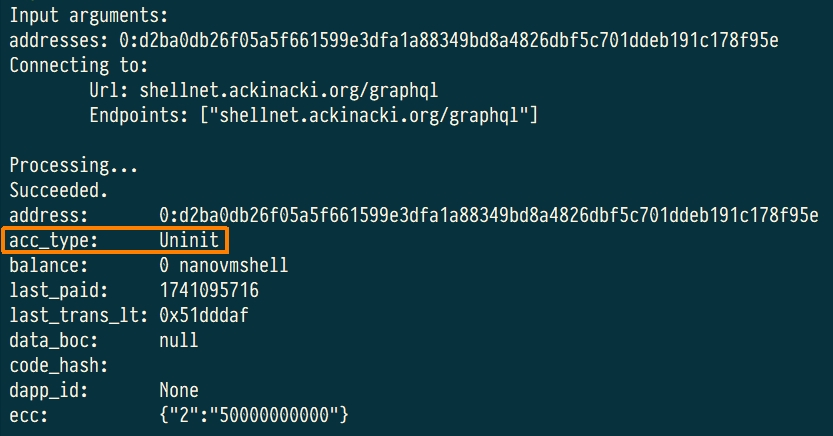

# How to deploy a Multisig Wallet

## Prerequisites <a href="#create-a-wallet" id="create-a-wallet"></a>

* [tvm-cli](https://github.com/tvmlabs/tvm-sdk/releases)

## **Prepare wallet binary and ABI** <a href="#create-a-wallet" id="create-a-wallet"></a>

Create a folder:

```
cd ~
mkdir wallet
cd wallet
```

Download the  [multisig.abi.json](https://raw.githubusercontent.com/ackinacki/ackinacki/refs/heads/main/contracts/multisig/multisig.abi.json) and [multisig.tvc](https://raw.githubusercontent.com/ackinacki/ackinacki/refs/heads/main/contracts/multisig/multisig.tvc) files for your wallet from the [multisig wallet repository](https://github.com/ackinacki/ackinacki/tree/main/contracts/multisig) and place them in this folder.


At the moment this wallet is undergoing formal verification. Wallet code may be updated during this process. However, the API of the wallet will remain the same.


## Configure CLI tool

In this guide, we will use the test network at [`shellnet.ackinacki.org`](https://shellnet.ackinacki.org).\
We need to specify the blockchain endpoint for deployment:

```
tvm-cli config -g --url shellnet.ackinacki.org/graphql
```

## Generate seed phrase, keys and address

In Acki Nacki blockchain, the Multisig wallet address depends on its binary code and initial data, which includes the owner's public key.

You can generate everything with one command:

```
tvm-cli genaddr multisig.tvc --save --genkey multisig.keys.json
```


**Write down your `seed phrase` and store it in a secure location. Never share it with anyone. Avoid storing it in plain text, screenshots, or any other insecure method. If you lose it, you lose access to your assets. Anyone who obtains it will have full access to your assets.**&#x20;

**Additionally, ensure the file containing the `key pair` is saved in a safe place.**



After this step, the `.tvc` file will be overwritten with the specified keys.


The `raw address` is the future Multisig wallet address. Keys are saved to `multisig.keys.json`. Be sure to copy your seed phrase if you need it.

<figure><figcaption></figcaption></figure>

## **Request SHELL tokens** <a href="#request-test-tokens-for-future-use" id="request-test-tokens-for-future-use"></a>


On Mainnet Shell tokens will be purchased via special pool


Request [SHELL tokens](https://docs.ackinacki.com/glossary#shell-token) to your address. If you plan to test your contract systems, you can use this Multisig wallet to top up the balances of these contracts to cover gas fees.

Please contact us in the [Telegram Channel](https://t.me/+1tWNH2okaPthMWU0).

## Deploy your Multisig wallet

Once you receive the SHELL tokens, check the state of the pre-deployed contract. It should be **`Uninit`**:

```
tvm-cli account <YourAddress>
```


The received SHELL tokens will be displayed in the `ecc` field.


<figure><figcaption></figcaption></figure>

Now you are ready to deploy your Multisig wallet using the following command:

```
tvm-cli deploy --abi multisig.abi.json --sign multisig.keys.json multisig.tvc '{"owners":[<PubKeyList>], "reqConfirms":<ConfirmsNum>, "value":<Tokens>}'
```

The arguments for the constructor must be enclosed in curly brackets:\
`{<constructor arguments>}`

* `owners`: An array of custodian public keys. Each key must include the `0x` prefix.
* `reqConfirms`: The default number of confirmations required to execute a transaction.
* `value`: The amount (_in_ [_nanotokens_](https://github.com/gosh-sh/TVM-Solidity-Compiler/blob/master/API.md#tvm-units)) of SHELL tokens to be exchanged for [VMSHELL tokens ](https://docs.ackinacki.com/glossary#vmshell)during deployment.


The `value` parameter must not be zero, as `VMSHELL` tokens are used to pay contract execution fees after the exchange.



In our example, we specify the amount of `10,000,000,000 nanoSHELL`, which will be converted into `10,000,000,000 nanoVMSHELL`. \
From this amount, the deployment fee for the contract will be deducted, and the remaining balance will be credited to the Multisig wallet.


<figure><figcaption></figcaption></figure>

Check the contract state again. This time, it should be `Active`.

<figure><figcaption></figcaption></figure>


In the `balance` field, you can see **10,000,000,000** nanoVMSHELL tokens, which were converted from SHELL during deployment (as specified in the `value` parameter). The remaining SHELL tokens can be found in the `ecc` field at index **`2`**.


If you need VMSHELL tokens later, simply call the `exchangeToken(uint64 value)` method in the Multisig and exchange the required amount.\
\
For example, let's convert 10 SHELL tokens into 10 VMSHELL tokens:

```
tvm-cli call 0:d2ba0db26f05a5f661599e3dfa1a88349bd8a4826dbf5c701ddeb191c178f95e exchangeToken '{"value":10000000000}' --abi multisig.abi.json --sign multisig.keys.json

```


`VMSHELL` tokens can be transferred to the balances of other contracts within the same Dapp ID.

However, when transferring to contracts in other Dapp IDs, only `SHELL` tokens can be used.

Therefore, you can create a single Multisig contract to replenish the balances of all your contracts with `SHELL` tokens, regardless of which Dapp ID they belong to.


## How to send tokens from Multisig Wallet

To replenish accounts before deployment, use the following command:

```
sendTransaction( address dest, uint128 value, mapping(uint32 => varuint32) cc, bool bounce, uint8 flags, TvmCell payload)
```

* `dest`  - the transfer target address;
* `value`  - the amount of funds (VMSHELL) to transfer (should be `0`);
* `cc`  - the type of ECC token and amount  to transfer;
* `bounce`  - [bounce flag](https://github.com/gosh-sh/TON-Solidity-Compiler/blob/master/API.md#addresstransfer): (should be `false`);
* `flags -`[sendmsg flags](https://github.com/gosh-sh/TON-Solidity-Compiler/blob/master/API.md#addresstransfer) (should be `1`);
* `payload` - [tree of cells used as body](https://github.com/gosh-sh/TON-Solidity-Compiler/blob/master/API.md#addresstransfer) of the outbound internal message (should be an empty string).&#x20;


In this case, the fees will be paid from the Multisig wallet's account



In order for the recipient's contract to be deployed, its constructor must include a [function for exchange SHELL tokens for VMSHELL](https://github.com/tvmlabs/sdk-examples/blob/main/contracts/helloWorld/helloWorld.sol#L22)


For example, we transfer 5 SHELL from the Multisig wallet's balance to the address of the future contract, with the fees also being paid from the Multisig wallet's balance:

```
tvm-cli call 0:d2ba0db26f05a5f661599e3dfa1a88349bd8a4826dbf5c701ddeb191c178f95e sendTransaction '{"dest":"0:2672bb98816f2f9088d027f99681b65e05843b19367fe690cb4b5130d04eccf1", "value":0, "bounce":false, "cc": {"2": 5000000000}, "flags": 1, "payload": ""}' --abi multisig.abi.json --sign multisig.keys.json
```

<br>
