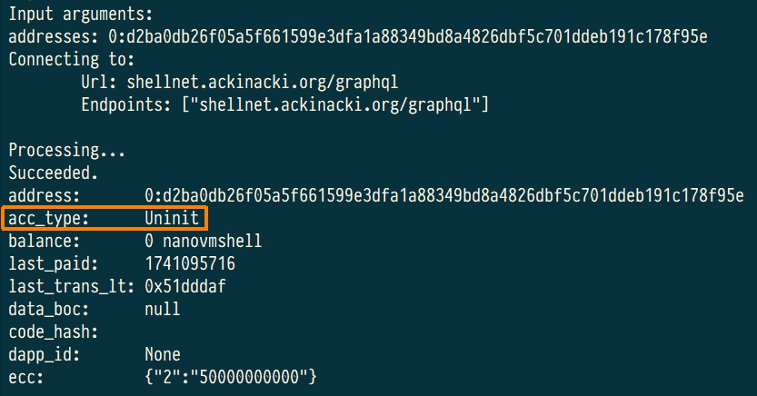
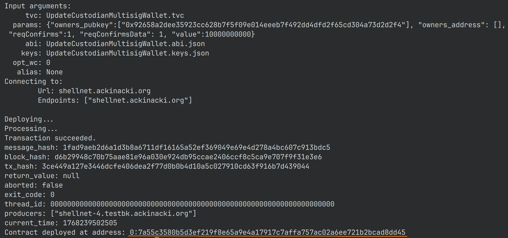
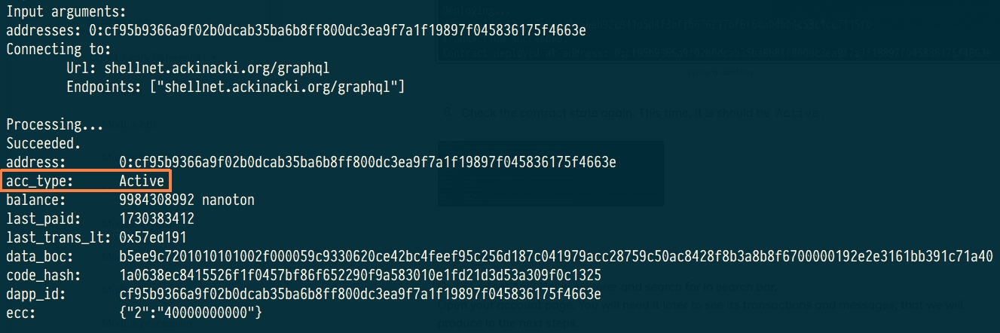

# How to deploy a Multisig Wallet

## Prerequisites <a href="#create-a-wallet" id="create-a-wallet"></a>

* [tvm-cli](https://github.com/tvmlabs/tvm-sdk/releases)

## **Prepare wallet binary and ABI** <a href="#create-a-wallet" id="create-a-wallet"></a>

Create a folder:

```
cd ~
mkdir wallet
cd wallet
```

Download the two files of the current wallet, `UpdateCustodianMultisigWallet_v2`, from the
[`0.81.0_compiled/updatecustodianmultisigwallet_v2`](https://github.com/ackinacki/ackinacki/tree/main/contracts/0.81.0_compiled/updatecustodianmultisigwallet_v2) directory and place them in this folder:

```
curl -O https://raw.githubusercontent.com/ackinacki/ackinacki/main/contracts/0.81.0_compiled/updatecustodianmultisigwallet_v2/UpdateCustodianMultisigWallet_v2.abi.json
curl -O https://raw.githubusercontent.com/ackinacki/ackinacki/main/contracts/0.81.0_compiled/updatecustodianmultisigwallet_v2/UpdateCustodianMultisigWallet_v2.tvc
```

Check what you downloaded -- the address depends on this exact code:

```
tvm-cli decode stateinit --tvc UpdateCustodianMultisigWallet_v2.tvc
```

`code_hash` must be `cfcaac10d43c8dc062298cb48df097be67cddec52b9cfd558309a7549f01c1f1`, size 10943
bytes.


The Solidity source of this contract is [here](https://github.com/ackinacki/ackinacki/blob/main/contracts/updatecustodianmultisigwallet_v2/UpdateCustodianMultisigWallet_v2.sol).



## Configure CLI tool

In this guide, we will use the test network at [`shellnet.ackinacki.org`](https://shellnet.ackinacki.org).\
We need to specify the blockchain endpoint for deployment:

```
tvm-cli config -g --url shellnet.ackinacki.org
```

For Mainnet, use `https://mainnet.ackinacki.org` the same way, or pass `--url` on each command.

### Two address forms

| where | form |
|---|---|
| the contract a command acts on | `dapp_id::account_id` |
| an address inside ABI arguments (`dest`) | `0:<account_id>` |

## Generate seed phrase, keys and address

In Acki Nacki blockchain, the Multisig wallet address depends on its binary code and initial data, which includes the owner's public key.

New key -- generate everything with one command:

```
# --save writes the public key INTO the .tvc; --genkey creates the key file
tvm-cli genaddr UpdateCustodianMultisigWallet_v2.tvc --save \
  --genkey UpdateCustodianMultisigWallet_v2.keys.json
```

Existing key or seed phrase -- same command with `--setkey`:

```
# key file
tvm-cli genaddr UpdateCustodianMultisigWallet_v2.tvc --save \
  --abi UpdateCustodianMultisigWallet_v2.abi.json \
  --setkey UpdateCustodianMultisigWallet_v2.keys.json

# or a seed phrase
tvm-cli genaddr UpdateCustodianMultisigWallet_v2.tvc --save \
  --abi UpdateCustodianMultisigWallet_v2.abi.json \
  --setkey "$PHRASE"
```


**`--save` is required.** It writes your public key into the `.tvc`, and that file is what you
deploy. The address `genaddr` prints is the one to fund.



**Write down your `seed phrase` and store it in a secure location. Never share it with anyone. Avoid storing it in plain text, screenshots, or any other insecure method. If you lose it, you lose access to your assets. Anyone who obtains it will have full access to your assets.**

**Additionally, ensure the file containing the `key pair` is saved in a safe place.**

**Sign with a key file** rather than a phrase where you can.



After this step, the `.tvc` file will be overwritten with the specified keys.


The `Raw address` is the future Multisig wallet address. Keys are saved to `UpdateCustodianMultisigWallet_v2.keys.json`

Be sure to copy your seed phrase if you need it.

<figure><figcaption></figcaption></figure>

## **Request Test tokens** <a href="#request-test-tokens-for-future-use" id="request-test-tokens-for-future-use"></a>

[VMSHELL](https://docs.ackinacki.com/glossary#vmshell) tokens are used to pay network fees and are derived from [SHELL](https://docs.ackinacki.com/glossary#shell) tokens.\
On the Mainnet, SHELL tokens are purchased via a special pool and then converted into VMSHELL tokens.

On the test network, you can request test tokens to be sent to your address. Please contact us on [Telegram](https://t.me/+1tWNH2okaPthMWU0) to receive them.

Sending them yourself, from another wallet -- **flag 16** credits an address that has no contract on
it yet, and the SHELL arrive as VMSHELL:

```sh
tvm-cli --url shellnet.ackinacki.org call <sender>::<sender> sendCurrencyWithFlag \
  '{"dest":"0:<your account id>","value":"3000000000","ecc":{"2":"3000000000"},"flag":16}' \
  --abi <sender abi> --sign <sender keys>
```


If you plan to test your smart contract systems, you can use the provided Multisig wallet to top up contract balances in order to cover gas fees.


## Deploy your Multisig wallet

Once you receive the test tokens, check the state of the pre-deployed contract. It should be **`Uninit`**:

```
tvm-cli account <YourAddress>
```


The received **VMSHELL** tokens will be displayed in the `balance` field.\
VMSHELL tokens are transferred and stored in (_in_ [_nanotokens_](https://github.com/gosh-sh/TVM-Solidity-Compiler/blob/master/API.md#tvm-units)) units.\
\
The received **SHELL** tokens will be displayed in the `ecc` field under index **2**


**How much you need.** The deploy costs **0.153501 VMSHELL** -- measured on both networks:

| network | before | after | cost |
|---|---|---|---|
| shellnet | 3000000000 | 2846499000 | 153501000 |
| mainnet | 2000000000 | 1846499000 | 153501000 |

The remainder stays on the wallet.

<figure><figcaption></figcaption></figure>

Now you are ready to deploy your Multisig wallet using the following command:

```
# --dst-dapp-id is required; for a wallet it equals its own account_id
tvm-cli deploy --abi UpdateCustodianMultisigWallet_v2.abi.json \
  --sign UpdateCustodianMultisigWallet_v2.keys.json \
  --dst-dapp-id <account_id> \
  UpdateCustodianMultisigWallet_v2.tvc \
  '{"owners_pubkey":[<PubKeyList>],"owners_address":[],"reqConfirms":<ConfirmsNum>,"reqConfirmsData":<NumConfirms>,"value":<NumTokens>,"minBalance":<Min>,"targetBalance":<Target>}'
```

Deploy the **same `.tvc` you ran `genaddr --save` on** -- that file carries your key.


The arguments for the constructor must be enclosed in curly brackets: `{<constructor arguments>}`.
`UpdateCustodianMultisigWallet_v2` takes **seven** of them, all required:

* **`owners_pubkey`** -- an array of custodians' public keys. Each key must include the **`0x` prefix**
* **`owners_address`** -- an array of custodian contract addresses.
* **`reqConfirms`** -- the number of signatures required to approve a transaction.
* **`reqConfirmsData`** -- the number of confirmations required to approve a change of custodians.
* **`value`** -- the amount (_in_ [_nanotokens_](https://github.com/gosh-sh/TVM-Solidity-Compiler/blob/master/API.md#tvm-units)) of **SHELL** tokens you want to exchange for **VMSHELL**.\
  If the exchange is not required, set the parameter `value` to **0**.
* **`minBalance`** -- the balance the wallet keeps for itself; `0` unless you need a floor.
* **`targetBalance`** -- the balance the wallet tops itself up to; `0` unless you need one.


**Paste the JSON as one line.** It is a single shell argument.


In our example, the command will be as follows:

```

tvm-cli deploy --abi UpdateCustodianMultisigWallet_v2.abi.json --sign UpdateCustodianMultisigWallet_v2.keys.json UpdateCustodianMultisigWallet_v2.tvc '{"owners_pubkey":["0x92658a2dee35923cc628b7f5f09e014eeeb7f492dd4dfd2f65cd304a73d2d2f4"], "owners_address": [], "reqConfirms":1, "reqConfirmsData": 1, "value":10000000000}'
```

<figure><figcaption></figcaption></figure>

Check the contract state again. This time, it should be `Active`


The contract deployment fee was deducted from the VMSHELL balance.


<figure><figcaption></figcaption></figure>


During contract deployment, **10** **SHELL** tokens were converted into **10** **VMSHELL** (values are specified in nanotokens).


## Multisig Wallet API

In the examples below:

* `<MSIG_ADDR>` — Multisig Wallet address (e.g. `0:7a55...dd45`)
* ABI file: [`UpdateCustodianMultisigWallet_v2.abi.json`](https://raw.githubusercontent.com/ackinacki/ackinacki/main/contracts/0.81.0_compiled/updatecustodianmultisigwallet_v2/UpdateCustodianMultisigWallet_v2.abi.json)
* Signer keys (one of the custodians): `UpdateCustodianMultisigWallet_v2.keys.json` , generated in the [previous step](how-to-deploy-a-multisig-wallet.md#generate-seed-phrase-keys-and-address)


The transaction **expiration time** is **1 hour**.



`VMSHELL`s attached to the message will be credited to the recipient’s balance minus fees, provided the message is sent between contracts **with the same** DAPP ID.\
If the DAPP IDs **are different**, the `VMSHELL`s will be burned


### How to Send Tokens From Multisig Wallet

* **If the required number of confirmations for transactions is 1,**\
  tokens can be sent using the function `sendTransaction`:

```solidity

sendTransaction(
        address dest,
        uint128 value,
        mapping(uint32 => varuint32) cc,
        bool bounce,
        uint8 flags,
        TvmCell payload)
```

**Parameters**

* `dest` - the transfer target address;
* `value` - the amount of funds (VMSHELL) used to pay fees (it must not be `0`);
* `cc` - a mapping of ECC token types to the token amounts to be transferred;
* `bounce` - [bounce flag](https://github.com/gosh-sh/TON-Solidity-Compiler/blob/master/API.md#addresstransfer): (should be `false`);
* `flags`- [send message flags](https://github.com/gosh-sh/TON-Solidity-Compiler/blob/master/API.md#addresstransfer) (should be `1`);
* `payload` - [tree of cells used as the body](https://github.com/gosh-sh/TON-Solidity-Compiler/blob/master/API.md#addresstransfer) of the outbound internal message (should be an empty string).


In this case, the transaction is executed immediately, without creating a request or requiring additional confirmations.


Example command:

```solidity
tvm-cli call <MSIG_ADDR> sendTransaction '{
  "dest":"0:2672bb98816f2f9088d027f99681b65e05843b19367fe690cb4b5130d04eccf1",
  "value":1000000000,
  "cc":{"2":5000000000},
  "bounce":false,
  "flags":1,
  "payload":""
}' --abi UpdateCustodianMultisigWallet_v2.abi.json  --sign UpdateCustodianMultisigWallet_v2.keys.json
```

*   **If you need to fund an account that has not yet been deployed,**\
    you should use the `sendTransaction` method with **flag 16**.

    \
    In this case, you transfer **SHELL** tokens, which are automatically converted into **VMSHELL** tokens and credited to the balance of the account you intend to deploy.\
    \
    **Example command:**

```solidity
tvm-cli call <MSIG_ADDR> sendTransaction \
'{
  "dest":"0:ceb8.....8d32c",
  "value":1000000000,
  "cc":{"2":5000000000},
  "bounce":false,
  "flags":16,
  "payload":""
}' \
--abi UpdateCustodianMultisigWallet_v2.abi.json  --sign UpdateCustodianMultisigWallet_v2.keys.json
```

As a result, the account balance will be credited with **5 VMSHELL**\
After the transaction is confirmed, you can safely run the deploy command again.<br>

* **If confirmation from multiple custodians is required**,\
  use the function `submitTransaction`:

```solidity
submitTransaction(
        address dest,
        uint128 value,
        mapping(uint32 => varuint32) cc,
        bool bounce,
        uint8 flag,
        TvmCell payload)
```

**Parameters**

* `dest` — the transfer target address;
* `value` — the amount of funds (VMSHELL) used to pay fees (it must not be `0`);
* `cc` — a mapping of ECC token types to the token amounts to be transferred;
* `bounce` — [bounce flag](https://github.com/gosh-sh/TON-Solidity-Compiler/blob/master/API.md#addresstransfer): (should be `false`);
* `flags` — [send message flags](https://github.com/gosh-sh/TON-Solidity-Compiler/blob/master/API.md#addresstransfer) (usually `1`);
* `payload` — [tree of cells used as the body](https://github.com/gosh-sh/TON-Solidity-Compiler/blob/master/API.md#addresstransfer) of the outbound internal message (usually an empty string).

**Return value**

* `transactionId` — identifier of the created multisig transaction.\
  This id is later used in [`confirmTransaction`](how-to-deploy-a-multisig-wallet.md#how-to-confirm-an-already-created-transaction).


The transaction will be executed only after the required number of confirmations is collected.


Example command:

```bash
tvm-cli call <MSIG_ADDR> submitTransaction '{
  "dest":"0:2672bb98816f2f9088d027f99681b65e05843b19367fe690cb4b5130d04eccf1",
  "value":1000000000,
  "cc":{"2":5000000000},   # 5 SHELL
  "bounce":false,
  "flags":1,
  "payload":""
}' --abi UpdateCustodianMultisigWallet_v2.abi.json --sign UpdateCustodianMultisigWallet_v2.keys.json
```


If the required number of confirmations for transactions is `1`, `submitTransaction` behaves like `sendTransaction` and executes immediately.


### How to Confirm a Transaction

To do this, use the function `confirmTransaction`

```solidity
confirmTransaction(uint64 transactionId)
```

**Parameters**

* `transactionId` — identifier of the transaction to confirm.\
  You receive it as a result of calling [`submitTransaction`](how-to-deploy-a-multisig-wallet.md#how-to-send-tokens-from-multisig-wallet)


If the transaction has already expired, it will be deleted.


Example command:

```bash
tvm-cli call <MSIG_ADDR> confirmTransaction '{"transactionId":123456789}' --abi UpdateCustodianMultisigWallet_v2.abi.json  --sign UpdateCustodianMultisigWallet_v2.keys.json
​
```

### How to create a request to update Multisig data

To change the list of custodians and the required number of confirmations, use the function `submitDataUpdate`

```solidity
submitDataUpdate(
        uint256[] owners_pubkey,
        address[] owners_address, 
        uint8 reqConfirms,
        uint8 reqConfirmsData)
```

**Parameters**

* `owners_pubkey` — array of custodian public keys;
* `owners_address` — array of custodian addresses;
* `reqConfirms` — required confirmations for regular transactions;
* `reqConfirmsData` — required confirmations for data update operations;

**Return value**

* `dataUpdateId`— identifier of the created multisig transaction.\
  This id is later used in [confirmDataUpdate](how-to-deploy-a-multisig-wallet.md#how-to-create-a-request-to-update-multisig-data)

Example command:

```bash
tvm-cli call <MSIG_ADDR> submitDataUpdate '{
  "owners_pubkey":[
    "0x0123456789abcdef0123456789abcdef0123456789abcdef0123456789abcdef"
  ],
  "owners_address":[
    "0:2672bb98816f2f9088d027f99681b65e05843b19367fe690cb4b5130d04eccf1"
  ],
  "reqConfirms":2,
  "reqConfirmsData":2
}' --abi UpdateCustodianMultisigWallet_v2.abi.json  --sign UpdateCustodianMultisigWallet_v2.keys.json
```

### How to confirm a request to update the Multisig data

To do this, use the function confirmDataUpdate

```solidity
confirmDataUpdate(uint64 dataUpdateId)
```

**Parameters**

* `dataUpdateId` — identifier of the data update request.\
  You receive it as a result of calling [`submitDataUpdate`](how-to-deploy-a-multisig-wallet.md#how-to-create-a-request-to-update-multisig-data)


If the request is expired, it will be removed


Example command:

```bash
tvm-cli call <MSIG_ADDR> confirmDataUpdate '{"dataUpdateId":987654321}' --abi UpdateCustodianMultisigWallet_v2.abi.json  --sign UpdateCustodianMultisigWallet_v2.keys.json

```
