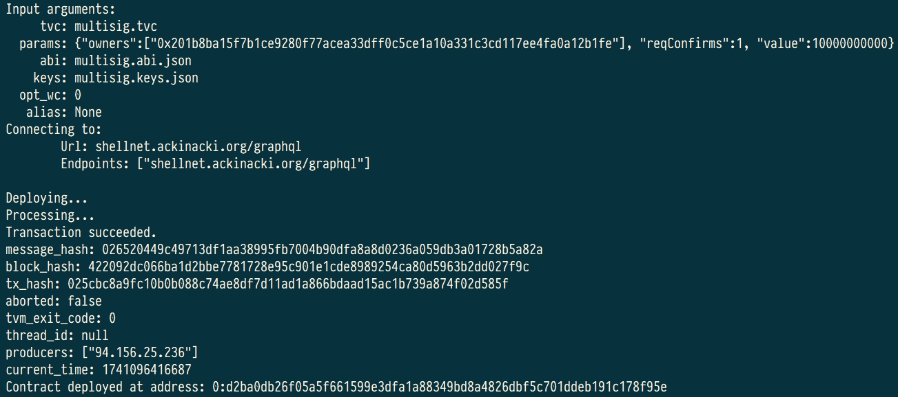

# How to deploy a Sponsor Wallet

## **Build and install CLI tool** <a href="#create-a-wallet" id="create-a-wallet"></a>

<pre><code>cd ~
git clone https://github.com/tvmlabs/tvm-sdk
<strong>cd tvm-sdk
</strong>cargo install --path tvm_cli --force
</code></pre>

The path to the `tvm-cli` is now publicly accessible. You can also add it to your environment variables (ENVs).

`export PATH=$PATH:~/tvm-sdk/target/release/tvm-cli`

## **Prepare wallet binary and ABI** <a href="#create-a-wallet" id="create-a-wallet"></a>

Create a folder:

```
cd ~
mkdir wallet
cd wallet
```

Download  [multisig.abi.json](https://github.com/ackinacki/ackinacki/blob/main/contracts/multisig/multisig.abi.json) and [multisig.tvc](https://github.com/ackinacki/ackinacki/blob/main/contracts/multisig/multisig.tvc) files for the sponsor wallet from the [multisig wallet repository](https://github.com/ackinacki/ackinacki/tree/main/contracts/multisig) and place them into this folder.


At the moment this wallet is undergoing formal verification. Wallet code may be updated during this process. However, the API of the wallet will remain the same.


## Configure CLI tool

We need to target the blockchain to which we will deploy. \
In this case, we are targeting the testnet.

```
tvm-cli config --url shellnet.ackinacki.org/graphql
```

## Generate seed phrase, keys and address

In Acki Nacki blockchain, the sponsor wallet address depends on its binary code and initial data, which includes the owner's public key.

You can generate everything with one command:

```
tvm-cli genaddr multisig.tvc --save --genkey multisig.keys.json
```


After this step, the `.tvc` file will be overwritten with the specified keys.


The `raw address` is the future sponsor wallet address. Keys are saved to `multisig.keys.json`. Be sure to copy your seed phrase if you need it.

<figure><figcaption></figcaption></figure>

## **Request SHELL tokens** <a href="#request-test-tokens-for-future-use" id="request-test-tokens-for-future-use"></a>

Request [SHELL tokens](https://docs.ackinacki.com/glossary#shell-token) on your address. If you plan to test your contract systems, request enough tokens, as this wallet will be used as sponsor wallet for  gas fees.

Please contact us in the [Telegram Channel](https://t.me/+1tWNH2okaPthMWU0).

## Deploy your sponsor wallet

Once you receive the SHELL tokens check the state of the pre-deployed contract. It should be **`Uninit`**:

```
tvm-cli account <YourAddress>
```

<figure><figcaption></figcaption></figure>


The received SHELL tokens will be displayed in the `ecc` field.


Now you are ready to deploy your sponsor wallet using the following command:

```
tvm-cli deploy --abi multisig.abi.json --sign multisig.keys.json multisig.tvc '{"owners":[<PubKeyList>], "reqConfirms":<ConfirmsNum>, "value":<Tokens>}'
```

The arguments of the constructor must be specified in curly brackets:\
`{<constructor arguments>}:`&#x20;

* `owners` – an array of custodian public keys;
* `reqConfirms` – the default number of confirmations required to execute a transaction;
* `value` – the number of SHELL tokens to be exchanged for [VMSHELL tokens](https://docs.ackinacki.com/glossary#vmshell) during deployment.

<figure><figcaption></figcaption></figure>

Check the contract state again. This time, it is should be `Active`.

<figure><figcaption></figcaption></figure>

## How to use a Sponsor Wallet

To replenish accounts before deployment, use the following command:

```
sendTransaction( address dest, uint128 value, mapping(uint32 => varuint32) cc, bool bounce, uint8 flags, TvmCell payload)
```

* `dest`  - the transfer target address;
* `value`  - the amount of funds (VMSHELL) to transfer (should be `0`);
* `cc`  - the type of ECC token and amount  to transfer;
* `bounce`  - [bounce flag](https://github.com/gosh-sh/TON-Solidity-Compiler/blob/master/API.md#addresstransfer): (should be `false`);
* `flags-`[sendmsg flags](https://github.com/gosh-sh/TON-Solidity-Compiler/blob/master/API.md#addresstransfer) (should be `0`);
* `payload` - [tree of cells used as body](https://github.com/gosh-sh/TON-Solidity-Compiler/blob/master/API.md#addresstransfer) of the outbound internal message (should be an empty string).&#x20;


In this case, the fees will be paid from the sponsor wallet's account



In order for the recipient's contract to be deployed, its constructor must include a function for exchange SHELL tokens for VMSHELL


For example: We transfer 5 SHELL from the sponsor wallet's balance to the address of the future contract, while the fees will be paid from the sponsor wallet's balance:

```
tvm-cli call 0:90c1fe4ab3a86a112e72a587fa14b89ecb2836da0b4ec465543dc0bb62df1430 sendTransaction '{"dest":"0:2672bb98816f2f9088d027f99681b65e05843b19367fe690cb4b5130d04eccf1", "value":0, "bounce":false, "cc": {"2": 5000000000}, "flags": 1, "payload": ""}' --abi multisig.abi.json --sign multisig.keys.json
```

\
